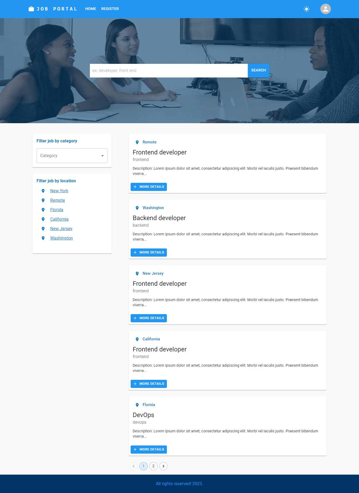
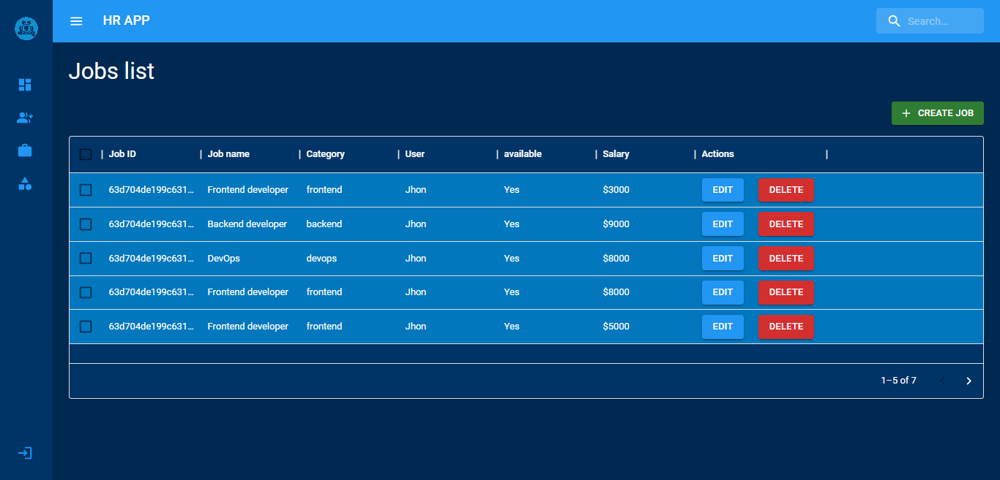

# job-portal-mern-stack
This is a Full stack job App made with MERN Stack, MUI, Datagrid, cookie, etc.  It is a Youtube series to teach step by step how to make a full stack App

##### To use this app: clone this repo, in the root of bonus folder create a .env file with these variables PORT=9000 DATABASE=YOUR_MONGO_URL JWT_SECRET=fidbfbFCDSm1558 NODE_ENV=development if in development mode and NODE_ENV=production if you're deploying your App; after that, run "npm install" in the bonus root folder. Go inside frontend folder in bonus folder, run "npm install "

# Features:
##### - Software Architecture: MVC pattern;
##### - HOC (High Order Component);
##### - Dark & Light theme mode with MUI (Material UI);
##### - Admin & user dashboard, pagination, Datagrid, Download in CSV, etc;
##### - Open & close dashboard sidebar;
##### - Admin can create jobs, create category, etc.
##### - Dashboard Analytic;
##### - Responsive App / MUI: Material UI;
##### - User can see his jobs history in user dashboard;
##### - Log In & Register Form with Formik and Yup for validation;
##### - Modern authentication system with JWT and cookie;
##### - Search job, filter jobs by category and location;
##### - Apply for a job in the single page job, if the user is already log In;
##### - Toast notification;

